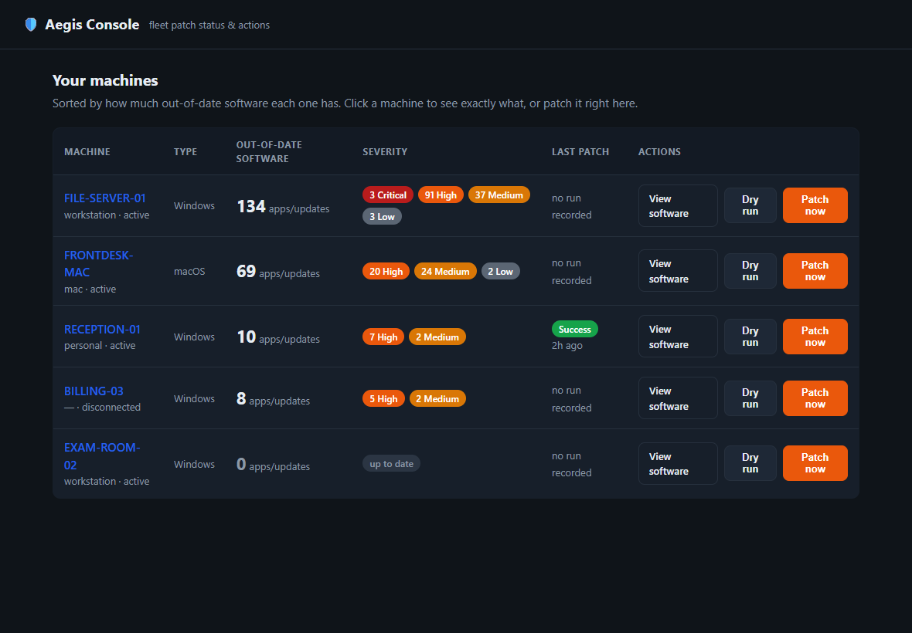
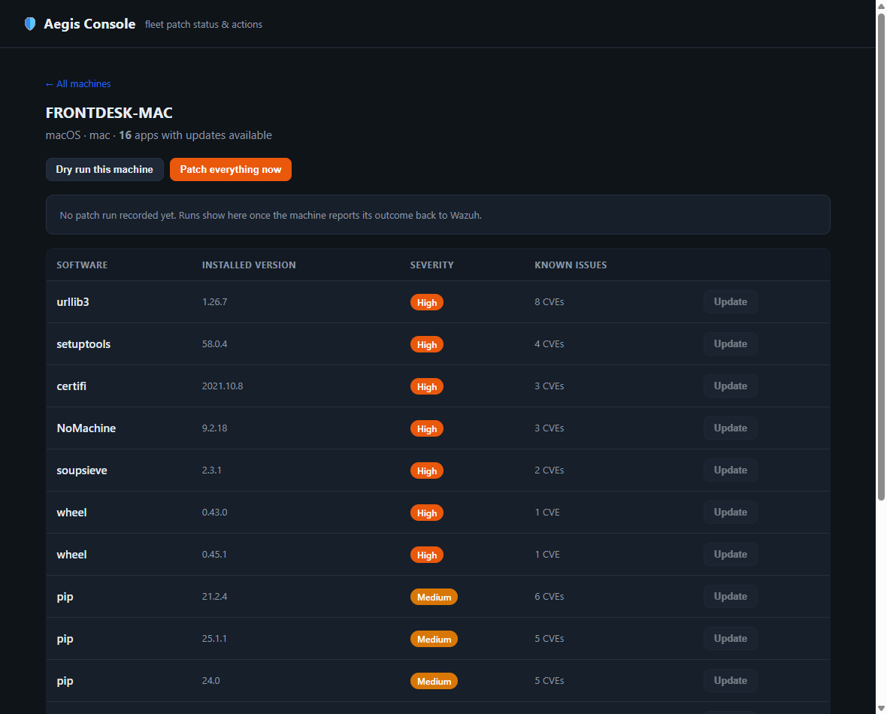

# Aegis

**One patch process for every machine — Windows, Linux, macOS — as a bolt-on to Wazuh.**

Aegis keeps a fleet current and protects line-of-business apps from blind upgrades. It carries
**no fleet-specific data**: a machine learns *who it is* from its Wazuh agent label, so this repo
is a generic engine you can drop onto any Wazuh-managed estate.

It patches the software that actually shows up as vulnerabilities — not just the OS, but third‑party
apps (Adobe, Chrome, NoMachine…) and even **per‑user installs** — and reports the outcome of every
run back to your SIEM.

---

## The operator console

Aegis pairs with a small local **operator console** that reads Wazuh's vulnerability data and drives
the engine — see the whole fleet's patch posture, drill into any machine, and dry‑run or patch with
one click.

**Fleet view** — every machine, how out‑of‑date it is, severity breakdown, and the result of its last patch:



**Machine view** — exactly what's out of date on a host, with per‑app detail and one‑click patch:



> The console is a thin companion UI (it only reads Wazuh + triggers the same Active‑Response commands
> you could `curl`). It's kept out of this repo because it holds infra connection details — this repo is
> the generic, publishable **engine**. *(Hostnames above are demo values.)*

---

## What Aegis patches

Each run works in layers so nothing important slips through the cracks:

| Layer | Windows | macOS | Linux |
|---|---|---|---|
| **Operating system** | Windows Update (PSWindowsUpdate) | `softwareupdate` | apt / dnf / yum |
| **Machine‑scope apps** | winget (as SYSTEM) | Homebrew formulae | package manager |
| **Third‑party GUI apps** | winget | Homebrew **casks** — *adopts* vendor‑installed apps (Adobe, NoMachine…) into brew so they get patched | — |
| **Per‑user installs** | winget in the **logged‑on user's** session (token impersonation) | brew runs as the console user | — |

Two details that make the coverage real:

- **Per‑user apps (Windows).** A patch job runs as SYSTEM, which only sees *machine‑scope* installs — so
  per‑user apps normally never get patched. Aegis grabs the console user's token
  (`WTSQueryUserToken`) and launches winget in their session via `CreateProcessAsUser`, scoped to
  user installs so it stays silent (no UAC). Machine‑scope stays with the elevated SYSTEM pass.
- **Vendor‑installed Mac apps.** Apps installed straight from a vendor (not via brew) are invisible to
  `brew upgrade`. Aegis **adopts** a curated set (`brew install --cask --adopt`) — installing the
  latest (which clears the finding) and handing future upkeep to brew. It only adopts apps that are
  already present; it never installs new software.

Self‑updating apps (e.g. Steam) are recognised and left alone. Line‑of‑business apps are protected via
per‑role **pins**.

---

## How it works

```
 Wazuh manager  ──Active Response──▶  agent: bin/aegis (wrapper)
   (role labels)                          │
                                          ▼
                                    aegis.ps1 / aegis.sh   ← reads the aegis.role label
                                          │                  → looks up roles.json policy
                                          ▼
                          patch-windows.ps1 / patch-mac.sh / patch-linux.sh
                                          │
                                          ▼
                          JSON outcome  →  aegis-patch.log  →  shipped to Wazuh → alerts
```

1. Each agent carries a Wazuh label `aegis.role` (set per **group** in the manager's shared config).
2. Aegis reads that label locally → maps it to a policy in [`roles.json`](roles.json) → runs the
   platform patch engine with the right scope + reboot behavior.
3. Every run writes a JSON line (`status`, what was updated, reboot needed, errors) to the Aegis
   app‑log for the SIEM to ship, monitor, and alert on — and the console reads it back as the machine's
   "last patch" result.

Roles are generic — `personal`, `workstation`, `clinical`, `server`, `mac`, `linux` — each with its own
patch scope and reboot policy (e.g. `clinical` never reboots). The mapping of *which machine is which
role* lives only in your Wazuh manager, never here.

## Components
| File | Role |
|---|---|
| `aegis.ps1` / `aegis.sh` | the engine — reads the label, applies the role policy, invokes the patcher |
| `roles.json` | generic role → policy (scope, reboot behavior, pins) |
| `patch-windows.ps1` | winget machine‑scope (SYSTEM) + per‑user pass (token impersonation) + Windows Update |
| `patch-mac.sh` | `softwareupdate` + Homebrew formulae + cask **adopt** pass |
| `patch-linux.sh` | apt / dnf |
| `bootstrap.ps1` / `bootstrap.sh` | one‑time installer (bolts onto an existing Wazuh agent) |
| `server-setup.sh` | one‑time manager setup (role groups, Active‑Response commands, log ingestion) |

## Install
Aegis rides on the Wazuh agent — install/enroll the agent first, then bootstrap. **Pin a tag/commit**
in production and verify checksums (`SHA256SUMS`).

**1. On the Wazuh manager (once)** — creates the role groups + labels, the Active‑Response command, and
app‑log ingestion. Run **on the server**:
```bash
curl -fsSL https://raw.githubusercontent.com/veteranop/Aegis/main/server-setup.sh | sudo bash
```

**2. On each agent** — bolts Aegis on + enables `remote_commands`:

**Windows** (Administrator):
```powershell
$env:AEGIS_REF='main'
irm "https://raw.githubusercontent.com/veteranop/Aegis/$($env:AEGIS_REF)/bootstrap.ps1" | iex
```
**Linux/macOS** (sudo):
```bash
export AEGIS_REF=main
curl -fsSL "https://raw.githubusercontent.com/veteranop/Aegis/$AEGIS_REF/bootstrap.sh" | sudo -E bash
```
> Public repo — no token needed. **Pin `AEGIS_REF` to a release tag** (not `main`) in production, and the bootstrap verifies `SHA256SUMS` before installing.
>
> **Windows prerequisite:** winget (the *App Installer* package) must be present — on older Windows 10
> images it may be missing or outdated. Confirm `winget --version` works before relying on app patching.

## Picking a role at install time
The bootstrap offers a numbered **role picker** (or pre-select with `AEGIS_ROLE=clinical` /
`-Role clinical` for scripted installs) and writes the choice to a local role file
(`%ProgramData%\Aegis\role` / `/etc/aegis/role`) — the box is patch-ready the moment
bootstrap finishes. Identity resolution order: **Wazuh `aegis.role` label (authoritative,
set per group on the manager) → local role file → refuse to patch blind.** The engine logs
which source it used (`source: wazuh-label | local-file | override`), so central labels
always win once assigned and any local-file box is visible in your SIEM.

## Running
- **On-demand:** the Wazuh manager triggers `aegis` via Active Response:
  ```bash
  curl -k -H "Authorization: Bearer $TOKEN" -X PUT \
    "https://<manager>:55000/active-response?agents_list=<id>" \
    -H "Content-Type: application/json" -d '{"command":"aegis-win0"}'   # or aegis-nix0
  ```
  > The API validates the name against `ar.conf`, which appends the timeout suffix — so it's
  > **`aegis-win0`/`aegis-nix0`**, not the bare `<command>` name from `ossec.conf`.
- **Live patching:** the dry-run commands above are the safe default. To actually patch, fire the
  separate apply commands — **`aegis-win-apply0`** / **`aegis-nix-apply0`** — which run the engine
  with `-Apply`/`--apply`. A live run installs updates and **may reboot** per the role's policy.
- **Scheduled:** a Wazuh `wodle command` in the group's shared config.
- **Manual/test:** `aegis.ps1 -Role personal` (dry run) — the engine refuses to patch a machine it
  can't identify.

Aegis defaults to **dry run**; pass `-Apply` / `--apply` to actually patch.

## Outcome logging
Every run appends one JSON line to the Aegis patch log (`%ProgramData%\Aegis\aegis-patch.log` /
`/var/log/aegis/aegis-patch.log`), shipped to Wazuh via the group's `localfile`. Fields include
`status`, per‑layer counts (`os_updates`, `apps_updated`, `user_apps_updated`, `casks_adopted`),
`reboot_required`, `errors`, and `duration_sec`. The manager's rules turn these into alerts, and the
console surfaces the latest one as each machine's **Last patch** result.

## Security model
- **No fleet data in this repo.** Identity comes from Wazuh labels; roles are generic.
- **`remote_commands` is the accepted‑risk gate.** The Wazuh‑triggered model makes the **manager a
  command‑execution root over the fleet** — treat it as a crown‑jewel host, harden its access, and
  monitor the Aegis app‑log in your SIEM.
- **Least privilege by run.** The user pass runs in the *user's* context (no elevation), machine/OS
  patching in the elevated SYSTEM/root pass — neither does more than its layer needs.
- **Pinned, checksum‑verified installs.** Pin `AEGIS_REF` to a release tag; the bootstrap verifies
  `SHA256SUMS`.

## License
See [LICENSE](LICENSE).
